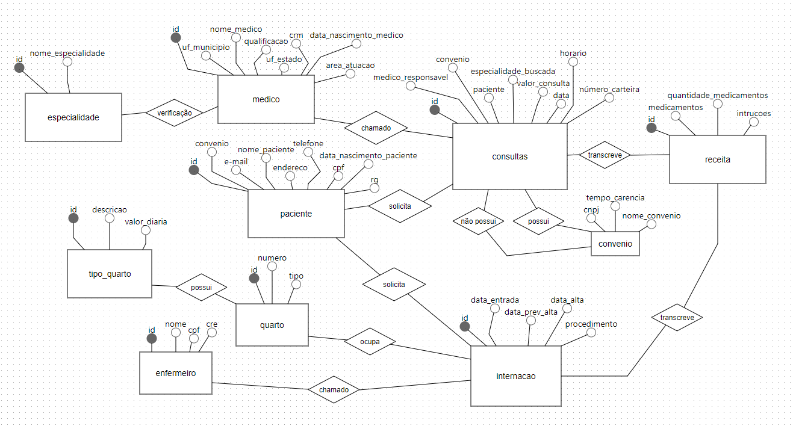

# Database_Hospital

## Estrutura do banco de dados

### especialidade
Cada médico pode ter até duas especialidades, entre as quais estão pediatria, clínica geral, gastroenterologia e dermatologia.

### medico
Os médicos devem informar se são generalistas, especialistas ou residentes, além de fornecerem seus dados pessoais, que incluem nome completo, CPF, data de nascimento, CRM, UF do estado, UF do município, área de atuação, especialidade e número para contato.

### paciente
Os pacientes devem fornecer as seguintes informações: nome, data de nascimento, endereço, telefone, e-mail, CPF, RG e indicar se possuem convênio.

### convenio
O convênio deve fornecer as seguintes informações: nome, CNPJ e período de carência.

### consultas
As consultas requerem a inclusão dos seguintes dados: data e horário da consulta, médico responsável, paciente, valor da consulta ou nome do convênio, juntamente com o número da carteira, e a especialidade procurada pelo paciente.

### receita
Na receita, serão registrados os medicamentos prescritos, juntamente com a quantidade e as instruções de uso.

### tipo_quarto
Aqui realizamos a verificação da sua descrição e o valor da diária associado.

### quarto
Na seção dos primeiros quartos, é inserido o número do quarto; imediatamente depois, é indicado o tipo, especificando se é um quarto individual ou compartilhado.

### enfermeiro
Na entidade "enfermeiro", são registrados o nome do profissional, juntamente com seu CPF e número do Conselho Regional de Enfermagem (CRE).

### internacao
Na fase de internação, é realizado o agrupamento dos dados da entidade "quarto" com a entidade "enfermeiro". Na entidade "internação", são obtidos os dados referentes à data de entrada no quarto, à previsão de alta no hospital, à data em que a alta foi registrada, juntamente com um texto contendo a descrição das ações a serem realizadas.
